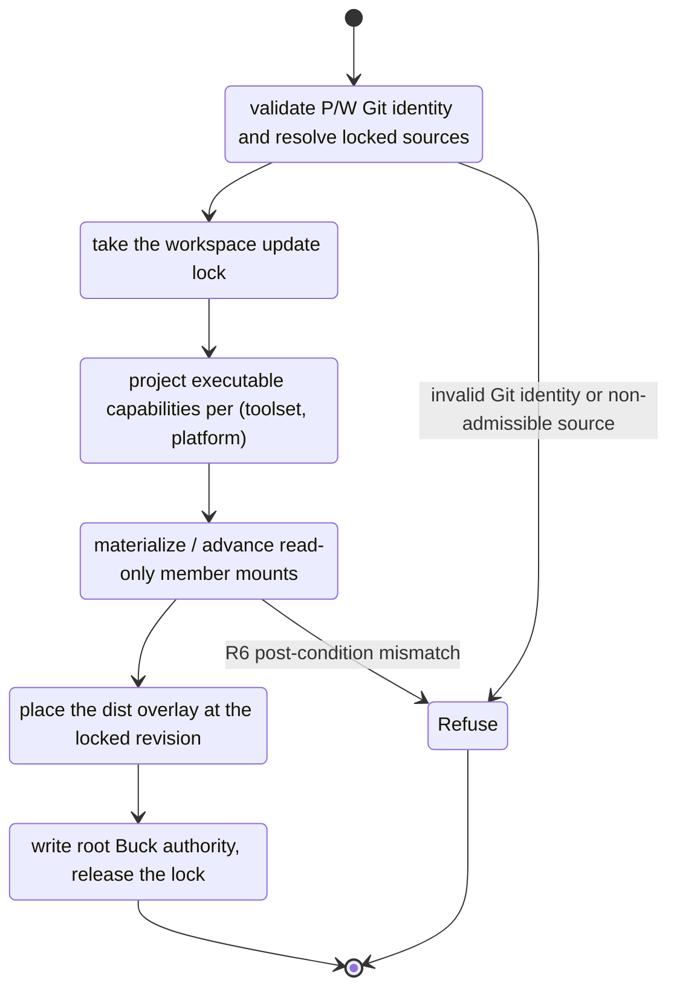

# Megarepo Spec

This document specifies the megarepo tool (`mr`): what it arranges on disk and
what it owns in a composition workspace. It builds on
[requirements.md](./requirements.md); terms are defined in
[ontology.md](./ontology.md).

## Status

Draft.

The tool's "why" is [vision.md](./vision.md), and
[requirements.md](./requirements.md) is ratified (2026-09-02). This spec
remains a draft: it records the ratified target — including the source
hierarchy the follow-up restructure PR is measured against — ahead of the
implementation reaching it.

## Scope

**Defines:** the two responsibilities of `mr` (repo arrangement and workspace
ownership), the CLI surface, the composition state machine, and the source
hierarchy.

**Does not define:** the buck2-facing composition contract — the composition
root shape, cell identity, action-identity hygiene, and the mount-shape
requirements (`COMP-R*`) live in
[../buck2/05-composition/](../buck2/05-composition/requirements.md) and are
referenced here, never restated. Nor does it define buck2 execution,
materialization, or cache wiring (`../buck2/02-*` … `../buck2/04-*`).

## Two Responsibilities

`mr` does two separable things. Everything in this spec belongs to one of them.

```text
  megarepo.kdl (intent)                  megarepo.lock (resolved state)
        │                                        │
        ▼                                        ▼
  ┌───────────────────────────────────────────────────────┐
  │ 1. Repo arrangement                                   │
  │    resolve sources → bare repos + per-ref worktrees    │
  │    in the store → liveness, hygiene, GC                │
  └───────────────────────────────────────────────────────┘
                          │ locked revisions + store worktrees
                          ▼
  ┌───────────────────────────────────────────────────────┐
  │ 2. Workspace ownership                                │
  │    acquire owned worktree → mounts → overlays →        │
  │    capabilities → publish root Buck authority          │
  └───────────────────────────────────────────────────────┘
                          │
                          ▼
                 composition workspace
```

Responsibility 1 is durable, host-global, and shared across every workspace on
the machine. Responsibility 2 is per-workspace and disposable: a workspace can
be town down and rebuilt from the lock plus the store.

## Repo Arrangement

### Intent and resolved state

Two files, never merged:

| File            | Role           | Authored     | Committed |
| --------------- | -------------- | ------------ | --------- |
| `megarepo.kdl`  | intent         | by hand      | yes       |
| `megarepo.lock` | resolved state | by `mr` only | yes       |

`megarepo.kdl` declares members as `name "<source>"`, where the source is a
GitHub shorthand (`owner/repo`), an HTTPS or SSH URL, or a local path, each
optionally suffixed `#<ref>`. `megarepo.lock` records, per member, the resolved
`url`, `ref`, 40-char `commit`, a `pinned` flag, and `lockedAt`. Local-path
members are not lock entries: there is nothing to resolve.

`pinned` and ref type are independent axes. Ref type says what a member
_tracks_ (branch mutable; tag and commit immutable); `pinned` says whether
`mr fetch --apply` may advance it.

### Store layout

The store (`$MEGAREPO_STORE`, default `~/.megarepo`) holds one bare repo per
remote and one worktree per ref, keyed by the ref's own path:

```text
~/.megarepo/<host>/<owner>/<repo>/
  .bare/                       # shared git objects
  HEAD -> refs/heads/<default> # default-branch tracking
  refs/heads/<branch>/         # branch worktree (mutable ref)
  refs/tags/<tag>/             # tag worktree (immutable)
  refs/commits/<sha>/          # commit worktree (immutable, pinned materialization)
  .archive/<name>/             # GC capture area, reaped after the retention TTL
  .state/                      # liveness registry, GC config, observation ledger
```

The path is the identity: `refs/{type}/{raw-ref-path}/` says both what a
worktree is checked out at and how mutable it is. A `refs/commits/<sha>/`
worktree is a _pinned materialization_ — `mr` put it there to satisfy an exact
lock entry, so its sha drifting from the lock is a contract violation, not a
skip (decision [0009](./.decisions/0009-apply-drift-postcondition.md)).

### Ref classification

Ref type is resolved in two phases. Phase 1 queries the local bare repo after
fetch (`refs/tags/<ref>`, then `refs/remotes/origin/<ref>`) — authoritative,
and the reason tags such as `jq-1.6` classify correctly. Phase 2 is a
heuristic fallback when the repo cannot answer: 40-char hex ⇒ commit; a
semver-like pattern (bare or prefixed) ⇒ tag; otherwise branch.

### Store liveness, hygiene, and GC

The store is shared across every megarepo on the host, so reclamation is
governed by cross-workspace evidence rather than by any single workspace's
view. Each workspace publishes its `livePaths` into the liveness registry at
`$STORE/.state/workspaces/<hash>.json`; membership of a path in _any_
workspace's live set is an absolute veto on deleting it.

Default `mr store gc` reclaims cold `refs/heads/*` worktrees through
short-circuiting gates in this order — default-branch guard, cross-megarepo
liveness veto, staleness (GitHub PR merged or closed), lossless floor, grace
timers — then captures by archive and reaps only after the retention TTL
(decision [0001](./.decisions/0001-reclaim-cold-worktrees-in-default-gc.md)).
`ref_mismatch` worktrees take a distinct clean-archive path that never invokes
the `mr store fix` repair behavior, trading the PR-state signal for a stronger
clean/lossless floor (decision
[0008](./.decisions/0008-ref-mismatch-clean-archive.md)). `--all` is the
protection-bypassing mode and honors none of this.

Composed workspace roots are conservatively retained by both default and
`--all` GC. GC inspects the nested owned worktree for Git and dirty-state
evidence, but the current archive primitive can only move a flat worktree.
Archiving a composed root stays disabled until a root-aware journaled archive
can preserve the complete workspace and its nested Git registration atomically.

Absence of evidence never licenses deletion: an unavailable `gh`, a failed
fetch, an unreadable workspace record, or an empty observation ledger all
resolve to _keep_.

## Workspace Ownership

### Workspace anatomy

A composition workspace is rooted at the store worktree path of the repo it
exists to develop. The workspace root is not itself a git repository; the owned
member is. The root shape and cell wiring are specified by
[../buck2/05-composition/spec.md](../buck2/05-composition/spec.md) — this
document specifies only what `mr` does to produce it.

### Workspace identity and creation

A composed root `P` is a rebuildable projection around one owned Git worktree
`W`, exactly `P/repos/<owned>`. The bare repository's worktree registration is
authoritative only when it names `W` and agrees with `W`'s `.git` pointer and
branch identity. Root generation metadata remains descriptive; there is no
root ownership manifest.

`mr store worktree new` reads composition intent from the target commit before
creating anything. For a composition-enabled branch it claims an absent `P`,
creates `P/repos`, runs `git worktree add` directly at final `W`, links the
owned config into `P`, and runs normal composition generation. It never stages
or publishes another root and never relocates `W`.

Creation may retry only recognizable partial births: an otherwise empty `P`
with an empty `repos`, or the exact registered `W` with matching Git identity
and a missing or correct root-config link. Before Git registration, any other
root entry or non-empty `repos` is foreign. A branch registered anywhere but
`W`, a mismatched `.git`/bare/branch identity, or an incorrect root-config
symlink is ambiguous and fails closed with exact paths. Refusal never moves
`W` or deletes bytes.

Routine application validates this composed Git shape, then only plans or
reconciles generated state. A legacy flat `P` is refused before mutation with a
typed instruction to recreate it through `mr store worktree new`. There is no
public cutover, recover, unlock, or composition-status lifecycle surface.

Store path resolution, pinning, status, and GC derive the same `P`/`W` pair
from the canonical registration shape. Both default cold GC and `gc --all`
hard-keep composed roots until a root-aware archive/delete primitive exists.
The flat recursive-delete path is never used for `P`.

### The composition state machine

`mr apply` is a state machine over one workspace, taking the update lock once
and publishing root Buck authority last so that no consumer can observe a root
that points at state not yet materialized.



Exclusivity of the owned member is not enforced by `mr` bookkeeping: it is
git's own one-worktree-per-branch rule. A second workspace on the same branch
is refused by git before `mr` has to have an opinion.

### Admission of a locked source

Only an immutable, canonical materialization may become a mount source: the
detached `refs/commits/<commit>` worktree at exact `HEAD` with no tracked,
untracked, or ignored entries. Ignored bytes are refused rather than silently
entering the content snapshot — an ignored file is still a byte on disk, and
admitting it would make two workspaces at the same commit disagree.

### Mount mechanism and content identity

The mount mechanism is `cp -a` from the immutable store, advanced by stage plus
`RENAME_EXCHANGE`, per COMP-R10 — the alternatives (hardlink farms, in-place
git-worktree regeneration, symlinks) are disqualified there on demonstrated
evidence and are not re-argued here. Two layers implement it:

| Layer                | Owns                                                                                      |
| -------------------- | ----------------------------------------------------------------------------------------- |
| R6 identity          | canonical tree scan, protected-tree verification, persisted mount manifest — content only |
| cp-a mount mechanism | copy, capability placement, protection, atomic advance, teardown, recovery                |

R6 defines _what a mount is_, independent of how it got there; the cp-a layer
is the only mechanism that currently produces one. The separation is
load-bearing: the mechanism validates its own output against an identity it
does not define, so a half-completed copy cannot certify itself.

Regeneration ordering within the mechanism is fixed: materialize → capability
copy → protect. The capability copy is not optional (`.buck2/capabilities` is
gitignored, so a mount without it fails at load time). Protection is files
`0444` / dirs `0555`; teardown chmods directories only, because `rm -rf` of a
protected mount otherwise fails. Advance is stage-plus-exchange, never
in-place. A dirty mount is detected by hash against the locked sha, and refused
rather than repaired.

On Darwin the R6 post-condition is mandatory rather than advisory:
case-insensitive APFS silently collapses colliding paths at materialization,
and the identity check is what turns that into a loud failure. `mr` branches on
`mv` exit codes and never on stderr text, because Darwin's errno rendering is
not stable (decision 0020 Amendment 1 in the buck2 tree).

### Dist overlay

A member mount carries tracked sources plus the member's Buck2-built dist
artifacts at the locked revision, pulled from the shared cache and built
locally only on miss. Which targets constitute the overlay is declared by a
per-member genie projection — a manifest, never a glob, so the overlay surface
is reviewable and cannot silently widen. The composition root's
`[project] ignore` covers `dist`, which is what keeps action digests pure
source while the consumption surface rides along
([../buck2/.decisions/0021-cross-member-types-dist-overlay.md](../buck2/.decisions/0021-cross-member-types-dist-overlay.md)).

### Reference-only members

`ignoredMembers` names configured legacy-symlink members that are checkouts,
not build inputs. Their entire `repos/<name>` path is added to the root
`[project].ignore`; no target or load may reference them. The legacy symlink is
admissible there precisely because Buck cannot traverse, hash, detect, or
invalidate through an excluded path.

## CLI Surface

| Command                          | Responsibility | Contract                                                              |
| -------------------------------- | -------------- | --------------------------------------------------------------------- |
| `mr init` / `mr add`             | arrangement    | create `megarepo.kdl`; add a member declaration                       |
| `mr fetch --apply`               | arrangement    | fetch remotes, advance unpinned members, then update the lock         |
| `mr lock`                        | arrangement    | record current workspace commits into the lock; never touches remotes |
| `mr apply`                       | ownership      | lock → workspace, exactly; never modifies the lock                    |
| `mr status` / `mr ls`            | both           | report intent vs lock vs workspace drift; read-only                   |
| `mr pin`                         | arrangement    | freeze a member against `mr fetch --apply`                            |
| `mr store gc` / `status` / `fix` | arrangement    | reclaim, report, and repair store worktrees                           |
| `mr exec`                        | both           | run a command across members                                          |
| `mr check`                       | both           | validate config, lock, and workspace consistency                      |

Filtering (`--only` / `--skip`, mutually exclusive) applies to bulk
arrangement commands; generators skip members that were not synced rather than
failing on a missing path.

Member-list views render with a spotlight model: items inside the cwd-derived
scope render fully, items outside it are dimmed, and `--all` disables dimming
because the user asked for the whole picture. Scope is supplied through a React
context and applied centrally by the shared row component — individual
renderers never set dimming for scope purposes, so the rule cannot drift per
view.

## Source Hierarchy

The hierarchy below was ratified as the target (q10, 2026-08-31) and is now the
current layout: `src/lib/` no longer exists.

```text
packages/@overeng/megarepo/src/
  core/                  # repo arrangement primitives, composition-agnostic
    git.ts ref.ts lock.ts config.ts
    megarepo-traversal.ts issues.ts observability.ts
    source-policy.ts version.ts
    nix-lock/
  composition/           # workspace ownership, one dir per state-machine stage
    acquisition/         # owned branch-attached worktree acquire + recover
    mounts/              # R6 identity + cp-a mount mechanism
    overlays/            # dist overlay declaration and lifecycle
    capabilities/        # capability projection and resolution
    root/                # composition-root generation
    apply/               # the state machine that sequences the above
  store/                 # store layout, liveness, hygiene, GC, locks
  sync/                  # member sync: store fetch + worktree placement
  generators/            # config-file generators (vscode workspace, JSON schema)
  buck2-manifest.ts      # public subpath export: ./buck2-manifest
  *.contract.ts          # OTel semantic-convention contracts, read by path
  cli/                   # unchanged
```

Two properties are the point of the split, and either one breaking is a reason
to reject a change that otherwise matches the tree:

1. **`core/` does not import `composition/`.** Repo arrangement is usable, and
   testable, without any composition concept. The dependency runs one way.
2. **`composition/` subdirectories mirror the state machine.** A stage of
   `mr apply` maps to exactly one directory, so the sequence in the code and
   the sequence in this spec are the same list.

`store/` is the home of the `store-*` family. Store layout, liveness, hygiene
and GC are arrangement-side, but the family is too large to sit as loose files
in `core/`, so it gets a sibling directory rather than a subdirectory of either
half.

`sync/` and `generators/` are siblings of `core/` rather than members of it.
Both reach into `composition/` — `sync/` inspects member mounts before it will
touch a member path, and `generators/` re-exports the composition-root
generators — so folding either into `core/` would break property 1.

`buck2-manifest.ts` stays a top-level file, not a member of `composition/`: it
is the package's public subpath export (`@overeng/megarepo/buck2-manifest`) and
its stability contract is external. The `*.contract.ts` files likewise stay at
the `src/` root, because the weaver registry references them by path. Tests
stay colocated with their subject (`*.unit.test.ts`, `*.integration.test.ts`
beside the module).

## Open Design Questions

None open.
