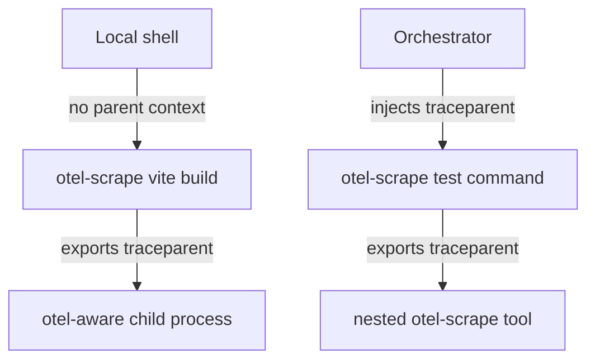

# Spec: otel-scrape

This document specifies the `otel-scrape` process wrapper and adapter contract. It builds on [requirements.md](./requirements.md).

## Status

Draft.

## Scope

**Defines:** the wrapper contract, adapter contract, event/span/metric classification, context propagation model, artifact-linking shape, and relationship to existing effect-utils packages.

**Does not define:** every adapter parser, an orchestrator, backend storage topology, dashboard layout, or profile-rendering UI.

## Package Boundary

`otel-scrape` is implemented as a dedicated Rust package under `packages/@overeng/otel-scrape`, producing a CLI binary named `otel-scrape`.

The package follows the existing `packages/@overeng/otelite` pattern: committed Cargo metadata, package-local Nix build file, flake package/app outputs, and devenv quality-gate integration. Rust owns the process wrapper mechanics; the public telemetry semantics still conform to the effect-utils contracts and VRS.

See [.decisions/0003-rust-package-boundary.md](./.decisions/0003-rust-package-boundary.md).

## Architecture

```
                      parent context? -- no --> mint root span
                            | yes
                            v
                     join parent trace
                            |
                  +---------v----------+
                  |  otel-scrape core  |
                  |  ----------------  |
   <cmd> -------> |  spawn + capture   | ---> child process
                  |  process spans     |        ^
                  |  context export ---+--------+
                  |  artifact links    |
                  +---------+----------+
                            |
                            v
                  +--------------------+
                  |  ToolAdapter       |
                  |  derived structure |
                  +---------+----------+
                            |
                            v
           OTEL spans/events/metrics       CAS profile artifacts
```

The wrapper owns the command span. An adapter enriches the tree; it does not own the command lifecycle.

## Adapter Contract

Illustrative TypeScript shape:

```ts
type AdapterEmit =
  | { readonly _tag: 'Event'; readonly event: OtelEvent }
  | { readonly _tag: 'Span'; readonly span: OtelSpanUpdate }
  | { readonly _tag: 'Metric'; readonly metric: OtelMetricSample }
  | { readonly _tag: 'Profile'; readonly profile: ProfileLink }

interface ToolAdapter {
  readonly name: string
  detect(invocation: Invocation): Effect.Effect<boolean>
  env(context: TraceContext): Effect.Effect<ReadonlyArray<readonly [string, string]>>
  parseLine(line: OutputLine): Effect.Effect<Option.Option<AdapterEmit>>
  parseArtifact(artifact: ArtifactDescriptor): Effect.Effect<ReadonlyArray<AdapterEmit>>
  finalize(outcome: RunOutcome): Effect.Effect<ReadonlyArray<AdapterEmit>>
}
```

`AdapterEmit` is deliberately a tagged union. A bare output line can only become an event unless an adapter explicitly constructs a span update or metric sample from structured data.

### Structured source and presentation ownership

A release adapter consumes a **declared, stable, structured source** (a named
format flag and schema); it does not parse a tool's default/human output.
Human-text parsing is not part of an adapter — it is at most a clearly-labeled
best-effort scraper outside the adapter contract. When the required structured
format replaces the tool's human stdout (e.g. oxlint `--format=json`), the
adapter **owns re-presentation**: otel-scrape re-renders a readable summary to the
terminal so instrumenting never degrades interactive output. Where the tool
offers a **side-channel** (structured to a file/fd while human output stays on
stdout, e.g. vitest `--reporter=json --outputFile.json`), the adapter prefers it
and does not re-render. Rendering lives in otel-scrape, per-adapter — never at the
call-site. Adapter-derived records are public-safe in every sink (severity, rule, line,
hashed filename, counts; raw diagnostic messages and paths dropped) per R27; the
terminal render MAY show full text (the operator's own machine, not a sink). See
[.decisions/0017-adapter-structured-source-and-presentation.md](./.decisions/0017-adapter-structured-source-and-presentation.md)
and requirement R30.

## Nested Adapter Ownership

Adapter parsing is owned by the leaf wrapper that directly launches the adapted tool. A parent `otel-scrape` invocation preserves passthrough stdout/stderr from nested wrapped commands, but it must not classify structured output already owned by a nested `otel-scrape` invocation.

This keeps nested wrappers compatible with root-or-join propagation without producing duplicate adapter-derived spans, events, metrics, or profile links. Parent wrappers still own their command span, observable process spans, resource facts, and passthrough behavior.

Implementation must provide an ownership or suppression protocol for nested wrappers. Downstream consumers must not be responsible for deduplicating duplicate adapter records.

Summary evidence exposes the stdout ownership decision as `adapter.ownership.stdout`:

- `this-wrapper` means this wrapper parsed captured stdout for the selected adapter.
- `child-wrapper` means the child command is another `otel-scrape` invocation, so this wrapper preserved stdout/stderr passthrough and descriptors but did not classify the child's structured adapter output.

See [.decisions/0002-leaf-wrapper-owns-adapter-parsing.md](./.decisions/0002-leaf-wrapper-owns-adapter-parsing.md).

## Classification Ladder

| Source shape                        | Classification | Example                                   |
| ----------------------------------- | -------------- | ----------------------------------------- |
| One output line, no lifecycle       | Event          | diagnostic, warning, informational line   |
| Start/end pair with stable identity | Span           | plugin transform, test case, compile unit |
| Duration-bearing structured record  | Span or metric | compile phase duration                    |
| Counter or aggregate statistic      | Metric         | diagnostics count, transformed file count |
| Native profile file                 | Profile link   | `trace.json`, `cpuprofile`, `pprof`       |

## Context Propagation



- `otel-scrape` reads W3C `traceparent` from the environment.
- If a parent exists, the command span joins it.
- If no parent exists, the command span roots the trace.
- The wrapper injects the active context into child processes.
- The wrapper exports its command-span context to children as **both**
  `TRACEPARENT` and `OTEL_TASK_TRACEPARENT`. A child sub-span emitter that prefers
  `OTEL_TASK_TRACEPARENT` (to survive shell/task re-evaluation) then re-parents
  under the otel-scrape command span rather than binding to an outer task span, so
  otel-scrape is a well-behaved reparenting layer (R13; falsified-and-fixed in
  `.experiments/0009-tsc-subspan-reparenting.md`, decision 0018).
- Context-specific facts stay on the span owned by the participant that knows them.

## Process-Tree Fidelity

`otel-scrape` records process-tree fidelity per platform/backend combination. A stable release may claim exact descendant process-tree spans only for combinations with validation evidence. Unsupported or unproven combinations remain explicit degraded support, not release blockers for combinations that are already exact.

Best-effort or sampled descendant discovery may exist only when explicitly marked as degraded/experimental output. Exact release validation must use public-safe runner-class evidence, not private machine identities.

The default implementation does not make a release-grade descendant process-tree claim. Summary evidence records `degraded.direct_child_only = true` and a `processes` observation block with `backend = "direct-child"`, `fidelity = "degraded"`, and `reason = "direct-child-only"`. In this degraded default the direct-child process observation is **merged into the command span** (`otel_scrape.process.observation.fidelity = "merged"`) rather than emitted as a separate span, so OTLP export emits one command span per wrapped command (named by the program basename) plus adapter/profile events (decision 0014). A distinct process span is emitted only under an exact backend that proves a real descendant.

Linux also has an opt-in `ptrace-experimental` backend. It may emit `fidelity = "exact"` for the traced child tree only when the compiled process-DAG fixture validates fork/vfork/clone, exec, exit, immediate-exit descendants, and nested descendants. The backend name remains experimental until ptrace perturbation, privilege, namespace, and operational caveats are resolved for default use.

Default exact process observation requires an event-source boundary that does
not perturb the wrapped command. On Linux, the preferred default-exact path is a
separate privileged helper that streams lifecycle events from kernel-supported
sources and correlates them through a run-scoped cgroup identity. Process
ancestry, process groups, sessions, and wrapper-generated run IDs may support
correlation, but they are not by themselves authoritative enough for an exact
cross-descendant claim. On macOS, the expected default-exact candidate is an
Endpoint Security-backed helper or an equivalently exact and supported system
event source, but macOS ARM stays degraded by default until that path is
validated in both the runner environment and the target host class with
entitlement, installation, user/admin approval, lifecycle, run-correlation, and
event-loss evidence.

The macOS ARM runner-class proof confirms this boundary: a minimal Endpoint
Security client can compile and link, but an ordinary task process receives
`ES_NEW_CLIENT_RESULT_ERR_NOT_PRIVILEGED` from `es_new_client`. Therefore the
public wrapper must not grow an unprivileged macOS exact backend. The only
release-grade macOS exactness path is a signed/entitled helper that can be
installed, approved, supervised, and validated as a fleet component.

The product boundary is split. `effect-utils` owns the stable wrapper-facing
contract: backend selection, helper protocol, process-observation schemas,
summary evidence, OTLP rendering, fake-helper fixtures, validation tests, and
release documentation. Fleet-specific privileged activation belongs outside the
public wrapper contract: system services, kernel capabilities, Endpoint
Security entitlements and approval, socket ownership, health checks, rollout,
and machine policy.

Sampling `/proc` snapshots can be useful debugging evidence, but it must remain
degraded because it can miss short-lived descendants.

See [.decisions/0005-exact-process-tree-fidelity.md](./.decisions/0005-exact-process-tree-fidelity.md), [.decisions/0011-linux-ptrace-process-backend.md](./.decisions/0011-linux-ptrace-process-backend.md), and [.decisions/0013-exact-process-helper-boundary.md](./.decisions/0013-exact-process-helper-boundary.md).

### Process Observation Backend Contract

A process observation backend produces immutable observations for process lifecycle facts it can prove:

```ts
type ProcessObservationFidelity = 'exact' | 'degraded' | 'experimental'

type ProcessObservationDegradedReason =
  | 'direct-child-only'
  | 'unsupported-platform'
  | 'missing-privilege'
  | 'ptrace-denied'
  | 'endpoint-security-unavailable'
  | 'event-loss'
  | 'namespace-unsupported'

interface ObservedProcess {
  readonly relation: 'direct-child' | 'descendant'
  readonly spanId: string
  readonly parentSpanId: string
  readonly pidHash: `sha256:${string}`
  readonly parentPidHash?: `sha256:${string}`
  readonly argvHash: `sha256:${string}`
  readonly exitCode?: number
  readonly termination?: {
    readonly _tag: 'Signal'
    readonly signal: number
    readonly synthetic_exit_code: number
  }
  readonly startUnixNano: number
  readonly endUnixNano: number
  readonly wallMs: number
}

interface ProcessObservation {
  readonly backend: string
  readonly fidelity: ProcessObservationFidelity
  readonly reason?: ProcessObservationDegradedReason
  readonly observed: ReadonlyArray<ObservedProcess>
}
```

An exact backend must observe fork or equivalent parent-child creation, exec or equivalent command identity changes, and exit for every descendant it includes. If the backend can detect that events were lost, privileges are missing, namespaces hide descendants, or platform support is unavailable, it must downgrade the whole observation or the affected records instead of emitting exact spans.

Linux exact support starts behind the explicit `ptrace-experimental` backend.
Linux exact-by-default support requires a helper-style backend with event-loss
and correlation semantics. Its exact run ownership authority is a run-scoped
cgroup identity, because global PID ancestry alone can leak across concurrent
runs and process reparenting. macOS exact support must use a mechanism that can
observe unknown descendants; `kqueue`/`EVFILT_PROC` is insufficient for this
because it starts from known process IDs only. Endpoint Security is the expected
macOS candidate, but exact support is gated on entitlement, installation,
user/admin approval, event-loss handling, and validation evidence from Apple
Silicon runner environments. See
[.decisions/0010-macos-process-observation.md](./.decisions/0010-macos-process-observation.md)
and [.experiments/0004-macos-endpoint-security-feasibility.md](./.experiments/0004-macos-endpoint-security-feasibility.md).

### Helper Stream Backend

The helper backend is a wrapper-facing event stream, not an OTLP exporter. It
exists to provide ordered process lifecycle facts to `otel-scrape`; the wrapper
still owns span construction, degradation policy, summary JSON, and OTLP export.

Initial CLI/configuration surface:

- `--process-backend helper-stream`
- `--process-helper-socket <path>`
- `OTEL_SCRAPE_PROCESS_BACKEND=helper-stream`
- `OTEL_SCRAPE_PROCESS_HELPER_SOCKET=<path>`
- `OTEL_SCRAPE_RUN_ID=<wrapper-generated run id>` propagated to the child

The wire format starts as versioned newline-delimited JSON over a local Unix
domain socket. Every message carries a protocol version, run identity, monotonic
event sequence, and event timestamp. The minimum event set is:

```ts
type HelperProcessEvent =
  | { readonly _tag: 'RunStarted'; readonly protocolVersion: 1; readonly runId: string; readonly eventSeq: number; readonly timeUnixNano: number }
  | { readonly _tag: 'Fork'; readonly protocolVersion: 1; readonly runId: string; readonly eventSeq: number; readonly timeUnixNano: number; readonly pidHash: `sha256:${string}`; readonly parentPidHash: `sha256:${string}` }
  | { readonly _tag: 'Exec'; readonly protocolVersion: 1; readonly runId: string; readonly eventSeq: number; readonly timeUnixNano: number; readonly pidHash: `sha256:${string}`; readonly argvHash: `sha256:${string}` }
  | { readonly _tag: 'Exit'; readonly protocolVersion: 1; readonly runId: string; readonly eventSeq: number; readonly timeUnixNano: number; readonly pidHash: `sha256:${string}`; readonly exitCode?: number; readonly signal?: number }
  | { readonly _tag: 'Loss'; readonly protocolVersion: 1; readonly runId: string; readonly eventSeq: number; readonly timeUnixNano: number; readonly reason: ProcessObservationDegradedReason }
  | { readonly _tag: 'RunFinished'; readonly protocolVersion: 1; readonly runId: string; readonly eventSeq: number; readonly timeUnixNano: number }
}
```

Exactness is fail-closed. A helper restart, event-sequence gap, `Loss` event,
version mismatch, run-id mismatch, helper disconnect, unpaired lifecycle event,
non-monotonic event timestamp, invalid fork/exec/exit ordering, multiple
external roots, missing privilege, namespace or cgroup ambiguity, or missing
exit downgrades the affected observation. The wrapper constructs process spans
and OTLP output from validated helper facts; the helper does not export OTLP or
own adapter semantics.

Correlation starts from a wrapper-generated run ID propagated to the child
environment. On Linux, an exact helper also binds the run to a dedicated cgroup
scope and treats that cgroup identity as the ownership authority for lifecycle
events. Platform helpers may additionally use process group, session, audit
token, or equivalent OS facts to support correlation, but global PID ancestry
alone is not authoritative because it can leak processes across concurrent
runs.

The helper stream's persisted evidence stays public-safe: it must not persist
raw argv, cwd, local paths, credentials, source text, or child output payloads,
and uses hashes and bounded reason codes instead. A platform-specific helper may
hold raw facts in memory for correlation across the protected local socket
boundary, but sanitizes them before any persistent log. The command-identity
trust gate (R27) governs raw fields only in the wrapper's OTLP export to an
asserted-private sink; persistent helper logs remain public-safe regardless.

### Platform Helper Realizations

The helper stream is the wrapper-facing contract; platform helpers are
realizations of that contract.

| Platform class   | Release-grade authority                                                 | Expected event source                                                          | Exactness gate                                                                                                   |
| ---------------- | ----------------------------------------------------------------------- | ------------------------------------------------------------------------------ | ---------------------------------------------------------------------------------------------------------------- |
| Linux runner     | Run-scoped cgroup or equally strong OS boundary                         | Kernel process lifecycle events with loss signaling                            | Process-DAG fixture, cgroup membership proof, namespace ambiguity downgrade, helper restart/loss downgrade       |
| macOS ARM runner | Endpoint Security process identity plus approved local service boundary | Endpoint Security process events, or an equivalently exact system event source | Entitlement/install/approval proof, event-loss handling, process-DAG fixture, degraded fallback when unavailable |

The fleet layer owns helper installation, service supervision, privileges,
socket ownership, and host policy. The wrapper accepts only sanitized helper
stream facts and applies the same validation rules for every realization.

Exactness verdicts are platform/backend-specific. A release support matrix must
state whether each runner class is exact, experimental, or degraded, and must
link the validation evidence that produced that verdict. The public claim is the
runner class and backend behavior, not a private host identity.

## Semantic Conventions

The names below are draft conventions. Final implementation must register or export them through a generated telemetry registry consumed by both Rust and TypeScript.

The registry source owns the span-**naming scheme**, the instrumentation scope identity, metric names, attribute keys, and profile-link wire fields. It does **not** own a fixed command span-name string: a span is named by the operation it represents (decision 0014), not by the instrumentation. Generated outputs must be checked for drift by the repo's normal generated-file gates. Rust and TypeScript code must consume generated bindings instead of hand-authoring duplicate literals.

See [.decisions/0004-generated-telemetry-registry.md](./.decisions/0004-generated-telemetry-registry.md) and [.decisions/0014-command-identity-and-span-naming.md](./.decisions/0014-command-identity-and-span-naming.md).

### Span naming

A span's name is the operation it represents; `otel-scrape` is carried in scope and attributes, never in the name (decision 0014):

- **Command span** — named by the wrapped program's **basename** (`tsc`, `vitest`, `pnpm`, `cargo`), a public-safe identity (never a path or args).
- **Process span** — named by the observed descendant program basename (`rustc`). Emitted as a _distinct_ span only under an exact backend that proves a real descendant; in the default degraded `direct-child` backend the process observation is **merged into the command span** (see Process-Tree Fidelity).
- **Tool-phase span** — named by the adapter phase (`typescript.project.check`).

Every `otel-scrape`-owned span carries `otel.scope.name = otel-scrape` and `otel_scrape.span.origin = otel-scrape` (adapter-derived phase spans use `otel_scrape.span.origin = otel-scrape-adapter`), so consumers identify and aggregate wrapper-owned spans without the name carrying the instrumentation. The attribute keys are the OpenTelemetry process semantic conventions (`process.executable.name`, `process.command_args`, `process.working_directory`, `process.exit.code`), pinned to semconv v1.37.0; vendor-only concepts stay under the `otel_scrape.*` namespace ([decision 0016](./.decisions/0016-adopt-otel-cli-span-semconv.md)). Where `otel-scrape` wraps a command already inside another instrumentation's task span (e.g. a devenv `devenv.task.exec`), the two cooperate: the task instrumentation owns the task level and `otel-scrape` owns the command/process/tool-phase levels beneath it; neither emits a second generic span for the same execution. In devenv this means the task span (`devenv.task.exec`, via otel-span) is not itself wrapped in `otel-scrape`; instead a concrete command inside the task is wrapped with a one-line `trace.instr { adapter ? "none" }` prefix (decision 0018). Orchestration tasks with no single concrete command stay task-span-only.

| Kind      | Name / attribute                           | Notes                                                             |
| --------- | ------------------------------------------ | ----------------------------------------------------------------- |
| Span name | program / phase / descendant basename      | Operation identity, not the instrumentation (0014)                |
| Attribute | `otel.scope.name`                          | Instrumentation scope; `otel-scrape` for wrapper-owned spans      |
| Attribute | `otel_scrape.span.origin`                  | `otel-scrape` or `otel-scrape-adapter`                            |
| Attribute | `process.executable.name`                  | Executable basename — public-safe identity, always present        |
| Attribute | `otel_scrape.command.argv_hash`            | Stable hash over argv — always present; the correlation/dedup key |
| Attribute | `otel_scrape.command.cwd_hash`             | Stable hash over cwd identity — always present                    |
| Attribute | `process.command_args`                     | Raw argv (`string[]`) — trust-gated (asserted private sink only)  |
| Attribute | `process.working_directory`                | Raw cwd / local path — trust-gated (asserted private sink only)   |
| Attribute | `otel_scrape.adapter.name`                 | Selected adapter                                                  |
| Attribute | `process.exit.code`                        | Exit status                                                       |
| Attribute | `otel_scrape.process.observation.backend`  | Process observation backend                                       |
| Attribute | `otel_scrape.process.observation.fidelity` | `exact`, `merged` (degraded direct-child), or degraded evidence   |
| Attribute | `otel_scrape.process.observation.relation` | Relationship to the wrapper command span                          |
| Attribute | `tool.name`                                | Tool identity when detected                                       |
| Attribute | `tool.version`                             | Tool version when cheap and safe                                  |
| Attribute | `profile.type`                             | Native profile kind                                               |
| Attribute | `profile.digest`                           | `sha256:...` digest                                               |
| Attribute | `profile.uri`                              | Artifact retrieval URI                                            |
| Attribute | `profile.ui`                               | Optional viewer URI                                               |

Identity is **public-safe by default**: `process.executable.name` (basename), `otel_scrape.command.argv_hash`, and `otel_scrape.command.cwd_hash` are always emitted; raw `process.command_args`/`process.working_directory` and local paths are emitted only into a sink an operator has explicitly asserted private (the trust gate — see Summary Evidence, OTLP Export Boundary, and requirement R27). The trust gate, never-default-emit, and high cardinality travel with the semconv rename ([decision 0016](./.decisions/0016-adopt-otel-cli-span-semconv.md)): adopting the standard keys does not make raw argv/cwd always-on standard fields. Credentials, source text, and child output payloads are never emitted to any sink regardless of trust.

The attribute keys adopt the OpenTelemetry process semantic conventions (semconv v1.37.0, [decision 0016](./.decisions/0016-adopt-otel-cli-span-semconv.md)): `command.program` → `process.executable.name`, `command.argv` → `process.command_args` (retyped to `string[]`), `command.cwd` → `process.working_directory`, `process.exit_code` → `process.exit.code`; the vendor concepts `command.argv_hash`/`command.cwd_hash`/`span.origin` move under `otel_scrape.*`. Renamed keys are retained in `telemetry-registry.json` as a deprecated evolution trail and the Rust/TypeScript bindings are regenerated.

## Summary Evidence

Summary JSON is local/debug evidence for tests, prototypes, and degraded-mode inspection. It is not the primary telemetry transport once OTLP export is enabled, but it must use the same privacy and identity rules as emitted telemetry.

The command summary records a public-safe identity plus stable hashes, not raw local inputs by default:

- `command.program` is the wrapped executable's basename — a public-safe identity, always present.
- `command.argv_hash` is a stable hash over the child argv vector — always present; the correlation/dedup key.
- `command.cwd_hash` is a stable hash over the current working directory identity — always present.
- Raw argv, cwd, and local absolute paths are **trust-gated** (requirement R27, [decision 0015](./.decisions/0015-trust-assertion-is-per-named-sink.md)): excluded by default, and emitted only into a sink an operator has explicitly asserted private **by name** (`--trusted-sink <sink>`). The summary is **hard-public-safe by default**: because it can be written into a public source tree, it never honors an OTLP trust assertion — raw fields enter the summary only under its own explicit `--trusted-sink summary`.
- Credentials, source text, and child output payloads are never embedded, regardless of trust.
- `processes.backend` names the active observation backend. `direct-child` is
  explicitly degraded and records only the spawned child process, even when the
  workload launches descendants.
- `processes.reason` is a stable degraded reason code when fidelity is not
  exact. Current and reserved codes are `direct-child-only`,
  `unsupported-platform`, `missing-privilege`, `ptrace-denied`,
  `endpoint-security-unavailable`, `event-loss`, and
  `namespace-unsupported`.
- `processes.observed[*]` records process evidence with span IDs, relationship,
  hashed PID identity, hashed parent PID identity where known, hashed argv
  identity, exit status, termination evidence, lifecycle timestamps, and
  wrapper-measured wall time. It does not include raw PID, argv, cwd, paths,
  credentials, source text, or child output.
- `child.exit_code` records normal process exit codes. Signal-terminated Unix
  children keep `child.exit_code = null` and record
  `child.termination = { _tag: "Signal", signal, synthetic_exit_code }`, where
  `synthetic_exit_code` is the wrapper process status returned to the parent
  using the conventional `128 + signal` mapping.

When the wrapper captures a stream for adapter parsing, the summary records an output descriptor for that captured byte sequence:

```ts
interface OutputDescriptor {
  readonly _tag: 'ContentDescriptor'
  readonly digest: `sha256:${string}`
  readonly byteLength: number
  readonly mediaType: string
}
```

The descriptor identifies the captured bytes by digest, byte length, and media type; it does not embed the output payload and does not imply the bytes were stored in CAS. Streams inherited directly by the child are represented as unavailable for descriptor purposes because the wrapper did not observe the bytes.

Resource facts are explicit. `resources.wallMs` is always wrapper-measured. Platform facts such as `resources.cpuTimeMs` and `resources.maxRssBytes` are `null` until a backend can prove them for the release platform, with `resources.availability.* = "unavailable"` documenting the absence.

## OTLP Export Boundary

`otel-scrape` starts with a small first-party OTLP/HTTP JSON exporter boundary before adopting a full Rust OpenTelemetry SDK. The boundary exists to prove the wrapper contract, adapter/profile span events, and `otelite` E2E capture without letting SDK lifecycle or metric semantics own the first release shape.

```text
otel-scrape
  -> command span
  -> adapter events / profile-link events
  -> OTLP/HTTP JSON exporter
  -> otelite capture fixture
```

Exporter configuration:

- `--otlp-endpoint <url>` enables OTLP export for a run.
- `OTEL_EXPORTER_OTLP_ENDPOINT` is the generic OTLP/HTTP environment fallback.
  For traces it is treated as a base URL and `/v1/traces` is appended.
- `OTEL_EXPORTER_OTLP_TRACES_ENDPOINT` is the trace-specific endpoint override
  and is used as-is. If it has no path, traces are posted to `/`.
- `--service-name <name>` sets the service name for emitted resource metadata.
- `OTEL_SERVICE_NAME` is the environment fallback and takes precedence over
  `service.name` from `OTEL_RESOURCE_ATTRIBUTES`.
- `OTEL_RESOURCE_ATTRIBUTES` supplies additional OTLP resource attributes.
- `--trusted-sink otlp` (env alias `OTEL_SCRAPE_TRUSTED_SINK`, pinned to the single OTLP target) asserts that the configured OTLP sink is a private, access-controlled destination, which permits raw `process.command_args`, `process.working_directory`, and local paths into this run's OTLP export (requirement R27, [decision 0015](./.decisions/0015-trust-assertion-is-per-named-sink.md), [decision 0016](./.decisions/0016-adopt-otel-cli-span-semconv.md)). The assertion names the sink it covers: an OTLP assertion never covers the local summary sink. It is explicit, per-named-sink, and off by default; `process.executable.name` + hashes are emitted with or without it, and credentials, source text, and child output payloads are never emitted regardless.
- **Non-leak invariant (tested):** a sentinel secret placed in a wrapped command's argv must be byte-absent from every sink the operator did not assert. This is a required regression test ([decision 0015](./.decisions/0015-trust-assertion-is-per-named-sink.md), [experiment 0006](./.experiments/0006-trust-gate-granularity.md)): with no assertion the sentinel is absent from all sinks; with `--trusted-sink otlp` the sentinel appears in the OTLP payload but stays byte-absent from the summary.
- `OTEL_EXPORTER_OTLP_HEADERS` supplies generic OTLP request headers.
- `OTEL_EXPORTER_OTLP_TRACES_HEADERS` is the trace-specific header override.
- `OTEL_EXPORTER_OTLP_TIMEOUT` and `OTEL_EXPORTER_OTLP_TRACES_TIMEOUT` configure
  exporter timeout in milliseconds; trace-specific wins.
- `OTEL_SDK_DISABLED=true` and `OTEL_TRACES_EXPORTER=none` disable trace export
  without changing command execution.
- Unrecognized enum values such as `OTEL_TRACES_EXPORTER=bogus` are warned about
  and ignored. Known trace exporters not implemented by this first-party
  exporter are warned about and do not silently fall through to OTLP export.
- `OTEL_EXPORTER_OTLP_PROTOCOL` and `OTEL_EXPORTER_OTLP_TRACES_PROTOCOL` are
  recognized. The first-party boundary supports `http/json`; `grpc` and
  `http/protobuf` disable this JSON exporter with a warning until a full SDK or
  protobuf exporter boundary exists. The current first-party transport supports
  plain `http://` endpoints only; secure `https://` export belongs with the
  SDK/protobuf transport rather than a partial TLS reimplementation.
- Empty OTEL environment variables are interpreted as unset. Boolean variables
  follow the official OpenTelemetry SDK convention: only case-insensitive
  `true` is true.
- If no OTLP endpoint and no summary path are configured, wrapper passthrough behavior stays indistinguishable from direct command execution.

Exporter failures are degraded wrapper evidence. They must not change child stdout, stderr, stdin, or exit status. Summary JSON remains local/debug evidence and must not become the primary telemetry transport.

The first OTLP slices emit the wrapper command span, adapter-derived span events, and profile-link span events using generated registry names and fields where available. Adapter metric records remain structured local records until trace correlation and OTLP metric semantics are explicit.

See [.decisions/0008-first-party-otlp-export-boundary.md](./.decisions/0008-first-party-otlp-export-boundary.md).

## Root Trace Surfacing

When `otel-scrape` mints the trace root (no inbound `traceparent`), it surfaces
the trace identity to the operator's terminal (stderr) at end of run, so agents
and humans can open or correlate the trace without first querying a backend
(R31, [decision 0020](./.decisions/0020-root-trace-surfacing.md)). This is
terminal presentation, not telemetry: no `telemetry-registry.json` entry, and it
is best-effort wrapper output like the existing diagnostics/warnings.

This section is the single normative home for the surfacing contract; decision
0020 carries the rationale.

**Root detection.** Surfacing happens only when otel-scrape owns the root; a
joined/nested run stays silent so exactly one participant surfaces per trace.
Root is determined the same way as span parenting: no inbound W3C `traceparent`
(`traceparent`/`TRACEPARENT`). Surfacing correctness therefore inherits
root-detection completeness — a run parented only through `OTEL_TASK_TRACEPARENT`
with no `traceparent` would be treated as root and could mis-surface; in the
devenv path the task wrapper always sets `traceparent`, so this does not arise.

**Gate.** Pure passthrough (no summary, no export attempted) emits nothing (R04).
Emission is bound to whether an export was **acknowledged**, never to the wrapped
command's exit code — a failing command still surfaces its trace (a red build is
when the trace is wanted).

**Two tiers.**

- **Resolvable URL** — printed iff `root ∧ export acknowledged (2xx) ∧ template
configured`. "Acknowledged" means the collector returned a 2xx to otel-scrape's
  own command-span POST. It does **not** prove downstream ingestion, retention
  under sampling, or that otel-aware children's sub-spans landed: an immediate
  click may transiently 404 under ingestion lag, or miss spans a downstream
  sampler dropped. The 2xx gate exists so the wrapper does not print a URL for a
  trace the collector outright rejected or never received; it is not a
  backend-ingestion guarantee.
- **Bare trace id** — printed when telemetry is active (a summary is configured
  or an export is attempted) but no resolvable URL exists: summary-only, no
  template, export disabled, or export failed. Activeness keys on the summary
  being _configured_, not on the write succeeding, so a bare id (never a URL) is
  still surfaced if the summary write itself fails — the trace id is real
  regardless. The id is actionable for local correlation —
  the summary records it (`trace.trace_id`), so it greps `summary.json`, an
  otelite capture, or a manual backend search. Export failures also keep their
  existing degraded-evidence warning.

Exit-scenario matrix (rows with `<url>` presume a `{traceId}` template is
configured; without one the row degrades to bare `trace:<id>`):

| Scenario                                                     | Export acknowledged? | Surfaced                       |
| ------------------------------------------------------------ | -------------------- | ------------------------------ |
| child exit 0, export 2xx, template set                       | yes                  | `trace:<id>  <url>`            |
| child exit non-zero, export 2xx, template set                | yes                  | `trace:<id>  <url>`            |
| child signal-terminated, export 2xx, template set            | yes                  | `trace:<id>  <url>`            |
| export 2xx, no template                                      | yes                  | bare `trace:<id>`              |
| export fails / disabled by env (summary or export attempted) | no                   | bare `trace:<id>`              |
| `--summary-out` only, no OTLP                                | n/a                  | bare `trace:<id>`              |
| pure passthrough (no summary, no export attempted)           | —                    | nothing (R04)                  |
| otel-scrape cannot spawn child                               | —                    | nothing (errors before export) |

**Backend-agnostic template.** The wrapper never constructs backend URLs (vision:
"not a dashboarding system"). It takes an opaque template with a `{traceId}`
placeholder and substitutes (replace-all) the lowercase-hex trace id (URL-safe):

- `--trace-url-template <tmpl>` / `OTEL_SCRAPE_TRACE_URL_TEMPLATE` (flag wins; an
  empty value is treated as unset).
- A template lacking `{traceId}` is **rejected** (warn + degrade to bare id): a
  static URL that does not point at this trace would mislead.
- A rendered URL containing control characters is **rejected** (warn + degrade to
  bare id): the surfaced line is a single agent-parseable line, so an embedded
  newline or terminal escape (OSC/CSI) must not be injectable through the
  template.
- The fleet supplies the template (its URL-encoded Grafana Explore/TraceQL URL
  with the trace-id position marked, e.g. `…query%22%3A%22{traceId}%22…&orgId=1`).
  Supplying that placeholder template is a fleet/R26 concern; the existing
  `OTEL_GRAFANA_LINK_URL` is pre-baked with a specific session trace id and is
  not a placeholder template.

**On/off.** `--trace-link on|off` / `OTEL_SCRAPE_TRACE_LINK` (default `on`; flag
wins). Both `on|off` and the repo's OTel boolean spelling `true|false` are
accepted (case-insensitive) so the switch reads naturally either way.
`off`/`false` suppresses all surfacing even when the gate passes. There is no
on-override past the R04 gate. Invalid values follow the tool's
explicit-strict / ambient-lenient split: a bad `--trace-link` value is a usage
error like every other flag (a malformed explicit invocation fails fast and
visibly), while a bad `OTEL_SCRAPE_TRACE_LINK` env value is warned about and the
default is kept — ambient env is parsed leniently, matching the other OTel
boolean env vars (`env_bool`).

**Format** mirrors the fleet `otel-trace` convention, with an `otel-scrape:`
prefix for attribution on shared stderr. TTY detection on stderr selects the
**encoding only**, never whether to emit (agents read piped stderr):

- stderr is a TTY → `otel-scrape: ` + OSC 8 hyperlink, label `trace:<id>`.
- stderr piped/redirected → plain `otel-scrape: trace:<id>  <url>` (or
  `otel-scrape: trace:<id>` in the bare tier).

**Privacy.** The surfaced text is stderr-only and MUST NOT enter the summary file
or OTLP export; a required regression line asserts the template string and
rendered URL are byte-absent from every sink. The one datum this adds beyond the
public-safe random trace id is the operator's own URL template, which may embed a
private backend hostname. This is a **conscious, operator-controlled tradeoff**,
distinct from the argv/cwd secret class the trust gate (R27,
[decision 0015](./.decisions/0015-trust-assertion-is-per-named-sink.md)) hardened
the summary against: the hostname enters only through the operator's own opt-in
template, never from the wrapped command, and the operator disables the whole
line with `--trace-link off`. The "terminal is not a sink" exemption
([decision 0017](./.decisions/0017-adapter-structured-source-and-presentation.md))
rested on interactive ephemerality; because this line also lands in piped and
CI-captured stderr, the safety rests on operator control of the template, not on
ephemerality.

## Artifact Store

Profile artifacts use the reusable [content-address VRS](../content-address/spec.md) for descriptors, object paths, `cas:` retrieval URIs, and manifest pins. `otel-scrape` writes artifact bytes into a per-run CAS root using the digest-derived object path. The span carries a location-independent profile link; the run context supplies the CAS root resolver.

```ts
interface ProfileLink {
  readonly type:
    'pprof' | 'cpuprofile' | 'rustc-self-profile' | 'tsc-trace' | 'cargo-timings' | string
  readonly digest: `sha256:${string}`
  readonly uri: `cas:sha256/${string}/${string}`
  readonly ui?: string
  readonly byteLength?: number
  readonly mediaType?: string
  readonly codec?: string
  readonly schemaVersion?: number
}
```

The span carries the descriptor. The artifact bytes live outside the OTEL backend. Retrieval resolves `uri` against the run's CAS root and verifies the digest and byte length before use, following the content-address resolver contract. Local runs may keep the CAS root on disk; CI runs must upload or expose the CAS root as one artifact tree. Each run should write and pin one manifest covering the retained profile artifacts. UI/download links are optional presentation metadata and are not the retrieval identity.

The Rust implementation keeps its artifact-lane CAS behavior in a private
module that mirrors the content-address contract with conformance vectors. The
public reusable implementation package remains `@overeng/content-address` until
a second Rust consumer or generated cross-language contract justifies a Rust
crate boundary.

See [.decisions/0006-cas-profile-artifact-uris.md](./.decisions/0006-cas-profile-artifact-uris.md), [.decisions/0009-rust-cas-module-boundary.md](./.decisions/0009-rust-cas-module-boundary.md), and [.experiments/0003-artifact-uri-prototypes.md](./.experiments/0003-artifact-uri-prototypes.md).

## Adapter Fleet

Initial adapters should prove the classification ladder across different source shapes before expanding the fleet.

The first implementation proves one real adapter path plus focused CAS/profile fixtures. One real adapter does not need to emit events, spans, metrics, and profile links in the same run. The implementation must still test wrapper command/process spans, adapter-derived records for the source shapes the adapter owns, and profile artifact behavior through the content-address contract.

See [.decisions/0007-first-adapter-plus-fixtures.md](./.decisions/0007-first-adapter-plus-fixtures.md).

| Adapter           | Structured source                         | Output                                    | Profile link     |
| ----------------- | ----------------------------------------- | ----------------------------------------- | ---------------- |
| `node-cpuprofile` | Node/V8 `--cpu-prof` artifact             | profile link                              | `cpuprofile`     |
| `cargo`           | `--timings=json`, `--message-format=json` | compile spans, diagnostics metrics/events | timings artifact |
| `tsc`             | `--generateTrace`                         | checker/program phase spans               | `trace.json`     |
| `vitest`          | JSON reporter / OTEL-aware tests          | suite and test spans                      | none             |
| `oxlint`          | JSON formatter                            | diagnostics events/metrics                | none             |
| `vite`            | profile/debug output where stable         | plugin transform spans/events             | `cpuprofile`     |

The `node-cpuprofile` adapter creates a run-scoped temporary profile directory
only for direct Node child commands, enables V8 CPU profiling through Node's
documented `--cpu-prof` options, validates discovered `.cpuprofile` JSON before
CAS storage, and records degraded evidence for non-Node commands, missing
profiles, multiple produced profiles, or malformed profile JSON. The temporary
filesystem path is not part of summary or OTLP evidence; consumers resolve the
profile through the emitted `cas:` URI and run CAS root.

Adapter fleet expansion is gated by the same vertical-slice bar as the first
profile adapter: structured source contract, passthrough preservation, privacy
tests, degraded-mode tests, OTLP/summary semantics, generated-registry updates,
CAS handoff for artifacts, and a consumer fixture where the adapter emits
profile links or other cross-package contracts. Candidate adapters such as
`cargo`, `tsc`, `vitest`, package-manager phases, and `vite` remain deferred
until they meet that bar.

A real-probe survey (`.experiments/0008-adapter-structured-source-contract.md`,
decision 0017) classified the fleet by structured source and presentation mode:
**oxlint** (`--format=json`) and **cargo** (`--message-format=json`) replace human
stdout and so require otel-scrape re-render; **vitest** (`--reporter=json
--outputFile.json`) offers a side-channel (human stdout preserved, no re-render).
`tsc`/`tsgo` have no structured _diagnostics_ source — the current devenv
`--extendedDiagnostics` text scraper is best-effort and not an adapter; the
deferred tsc _phase_ adapter path is `--generateTrace` (a `trace.json` artifact),
distinct from diagnostics. `vite`, `storybook`, and `pnpm` expose no
per-diagnostic structured source.

### Adapter Admission Policy

Every supported adapter must land as a coherent contract slice:

| Gate           | Requirement                                                                                                                                                                                                                                                                                                       |
| -------------- | ----------------------------------------------------------------------------------------------------------------------------------------------------------------------------------------------------------------------------------------------------------------------------------------------------------------- |
| Source         | A declared, stable, machine-readable format (named flag + schema) or native artifact. Human-text parsing is not part of a release adapter — at most a clearly-labeled best-effort scraper outside the adapter contract (decision 0017).                                                                           |
| Presentation   | If the required format replaces the tool's human stdout, otel-scrape re-renders a readable summary (presentation ownership, R30); if the tool offers a side-channel (structured to file/fd, human stays on stdout), the adapter prefers it. Instrumenting must not degrade interactive output (decision 0017).    |
| Classification | Each emitted event, span, metric, or profile link follows the classification ladder.                                                                                                                                                                                                                              |
| Privacy        | Command identity is public-safe by default (`process.executable.name` basename + argv/cwd hashes, always present); raw argv/cwd/local paths are trust-gated (emitted only to an operator-asserted private sink, R27). Credentials, source text, output payloads, and profile bytes are never emitted to any sink. |
| Degradation    | Missing tools, malformed artifacts, parse failures, unsupported command shapes, and exporter failures preserve passthrough behavior and emit bounded degraded evidence.                                                                                                                                           |
| Registry       | New stable names and fields are added to `telemetry-registry.json` and regenerated into Rust/TypeScript.                                                                                                                                                                                                          |
| Contract       | Cross-package payloads decode through `@overeng/otel-contract` or a documented VRS contract before support is claimed.                                                                                                                                                                                            |
| E2E            | A representative wrapped command proves summary evidence, OTLP export where applicable, and CAS resolution for profile artifacts.                                                                                                                                                                                 |

Candidate order is conservative and split by lane:

1. Cargo JSON/timings: first general adapter-fleet candidate because Cargo has
   structured compiler and timing output, but support waits for a stable
   compile-unit/event mapping and artifact contract.
2. `tsc --generateTrace`: first profile/artifact build-tool candidate once
   artifact grouping, CAS handoff, retention size, and phase-to-span semantics
   are specified.
3. Vitest JSON or OTEL-aware tests: useful for suite/test spans once identity
   and nested wrapper ownership are stable.
4. Package-manager phases and Vite profiles: defer until the structured-source
   audit proves the adapter can avoid debug-log parsing.

Candidate adapter names remain rejected by the CLI until the adapter's vertical
slice lands. Placeholders would make unsupported evidence look supported.

See [.decisions/0012-adapter-admission-policy.md](./.decisions/0012-adapter-admission-policy.md).

## Release Documentation Contract

Public release documentation must distinguish supported capabilities from
prototype/degraded evidence:

- Summary JSON is local evidence; OTLP command-span export is the telemetry
  transport currently implemented.
- Adapter metrics are not OTLP metrics until DQ1 is resolved with a backend
  query and E2E proof.
- Profile artifacts are handed off by retaining the run CAS root and a manifest
  pin; the `cas:` URI plus descriptor is the durable identity.
- Command identity is public-safe by default (`process.executable.name` basename
  plus argv/cwd hashes); raw argv, cwd, and local paths are trust-gated and enter
  OTLP only when the sink is explicitly asserted private (R27). Credentials, source
  text, profile bytes, and child output payloads are never emitted to any sink.
- Descendant process-tree spans are release claims only for platform/backend
  combinations with exactness tests. The current exact claim is limited to
  Linux `ptrace-experimental`; default output and macOS evidence remain
  degraded until helper-backed runner-class validation proves exactness.
- Adapter support matrices distinguish supported adapters from candidates. A
  candidate is not a release claim until its vertical-slice gate passes.

## Relationship To Existing Packages

- `@overeng/otel-contract` owns typed OTEL values and validation. `otel-scrape` should consume those types rather than creating untyped primitives.
- `@overeng/utils` contains existing node command and OTEL helpers. The implementation should reuse those helpers where they satisfy the wrapper contract.
- `context/content-address` owns reusable artifact identity and resolver semantics; `@overeng/content-address` is the first implementation package.
- `@overeng/utils-dev` / otelite can provide local test assertions for emitted spans, events, metrics, and profile descriptors.

## Open Design Questions

**DQ1 - Adapter metric correlation:** Should adapter metrics become OTLP metric points, span events, span attributes, or remain local summary records when a run needs trace-correlated diagnostics? This is resolved when one adapter metric shape has a concrete backend query use case and an E2E proof that the chosen representation preserves correlation without faking metric semantics.
