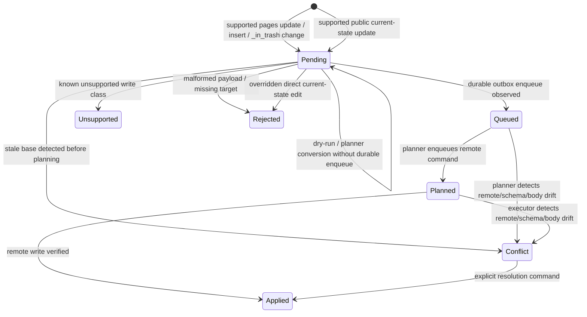

# Replica API Spec

Sub-system slice of [spec.md](../../spec.md). Serves [requirements](./requirements.md).

Requirement trace: REPLICA-R01, REPLICA-R02, REPLICA-R03, REPLICA-R04, REPLICA-R05, REPLICA-R06, REPLICA-R07, REPLICA-R08, REPLICA-R09, REPLICA-R10, REPLICA-R11.

The authoritative user-facing write-support matrix (keyed by SQL operation) lives in [capability-gaps.md](../../capability-gaps.md#by-sql-operation).

## Public SQLite Data File

The public SQLite data file is the local Notion data-source surface exposed to
users and automation. By default, one SQLite artifact maps to one tracked
Notion data source. It is analogous to the `.nmd` files in
`@overeng/notion-md`: local tools operate on this artifact, while CLI sync
reconciles it with Notion.

```text
workspace/
  notion.workspace.v1.json
  data/
    v1/
      tasks.sqlite
      customers.sqlite
  .notion/
    v1/
      state.sqlite
```

The public data file has a canonical user schema plus read-only debug surfaces:

| Surface             | Key shape                           | Purpose                                                                                     |
| ------------------- | ----------------------------------- | ------------------------------------------------------------------------------------------- |
| `pages`             | `(_page_id)` plus local pending IDs | Canonical writable 1:1 data table for the Notion data source                                |
| `schema`            | `(database_id, data_source_id)`     | Read-only view for data-file binding, metadata, schema hashes, and sync identity            |
| `schema_properties` | `(property_id)`                     | Read-only view for property ID/name/type/write-class to `pages` column mapping              |
| `changes`           | `(change_id)`                       | Public local change requests, planner status, and settlement evidence                       |
| `conflicts`         | `(conflict_id)`                     | Open/resolved conflicts projected for user inspection                                       |
| `sync_status`       | `(database_id)`                     | Page counts, pending counts, checkpoints, guards, doctor state, read-only migration preview |
| `debug_*`           | view-specific                       | Read-only diagnostics over normalized pages, cells, outbox, hashes                          |

`pages` is the default user-facing table. Columns are generated from the latest
observed Notion data-source schema, ordered as Notion properties first and `_`
system columns last. `schema_json` is not present in `pages`; users inspect
schema through `schema` and `schema_properties`.
`schema_properties` records the stable mapping from each Notion property id to
its current `pages` column, display name, Notion type, ordinal, and write class.
Display names are convenient SQL labels only; property ids remain authoritative
for planning, hashing, conflict detection, and settlement.

The public v1 data-file namespace is a clean break: `pages` is the only
writable page/property SQL surface. The data file must not expose a public
`rows` table/view. Any implementation-internal row projection or terminology is
private and must not appear in public SQLite
schema, CLI help, docs, or tests as a user contract.

`schema` and `schema_properties` are read-only. The data file has no SQL write
path for schema: `ALTER TABLE pages ...` (DDL) is rejected, and there is no
`kind=schema` write intent in the public `changes` table. The file may surface a
read-only migration preview through `sync_status` / `debug_*`, but applying
schema changes is CLI-only. Schema migration semantics, ownership, and the
two-phase plan/apply contract live in
[../schema-migration/spec.md](../schema-migration/spec.md).

Observation uses the live retrieved data-source schema by default. Explicit
schema-property JSON is an advanced fake/debug override; it is not required for
`track`, watch observation, or normal established sync.

`debug_*` views are rebuildable diagnostics, not writable surfaces. Notion UI
views may appear in debug inventory, but they are never page membership or
deletion authority.

Hidden implementation state stores lossless canonical values, scalar helper
values, base/current/local hashes, outbox state, and migration/checkpoint data.
It is not public API and may use private SQLite tables internally. Read
visibility is broader than write eligibility: computed, relation, people, file,
and unsupported values remain visible when observed, while direct `pages` writes
are accepted only for modeled writable classes with complete values. Updating
supported scalar/property columns on `pages` is the ordinary direct local edit
path. The data-file layer resolves the page column through
`schema_properties`, converts the SQL value to canonical Notion-shaped JSON,
updates local desired state, and queues a guarded public `changes` entry.
Remote writes must be derived from validated Notion-shaped payloads, not from
helper columns alone.

Direct current-state edits are captured with local CDC triggers. `pages` is the
public intent entry surface, `changes` is the public intent ledger, and hidden
implementation state is the durable local authority the planner converts into
outbox commands. Direct edits use final-state semantics, not replay semantics:
repeated edits for the same cell coalesce to one effective pending change with
the latest desired value, and page lifecycle toggles supersede earlier pending
direct lifecycle changes when the current local page state no longer matches
them. Invalid direct cell payloads are rejected before `pages`, `debug_*`,
hidden implementation state, or `changes` state changes.

`sync_status` is the public aggregate health surface for the data file. It derives
state from `changes`, `conflicts`, hidden outbox state, guards, tombstones,
capability checks, and scan checkpoints; users do not write it directly. The
public `state` values are:

| State         | Meaning                                                                                         |
| ------------- | ----------------------------------------------------------------------------------------------- |
| `clean`       | No pending public work, open conflicts, unsupported work, degraded guards, or incomplete scans  |
| `pending`     | User-authored local work or durable outbox work is waiting to be planned, executed, or settled  |
| `conflicted`  | Open conflicts or local changes settled as conflicts require explicit resolution                |
| `unsupported` | A local change or observed capability is known unsupported and must not be retried as pending   |
| `degraded`    | Reconciliation, blocked/fenced/ambiguous outbox, guards, or unclassified tombstones need repair |
| `incomplete`  | Query or page-property hydration is incomplete, capped, or based on a changed query contract    |

Priority order is `conflicted` > `unsupported` > `degraded` > `incomplete` >
`pending` > `clean`. Unsupported and incomplete hydration are confidence
signals, not dirty local work: they do not increment `pending_local_changes`
unless a user-authored change is actually pending.

Public schema versions are separate:

| Version                     | Scope                                                       |
| --------------------------- | ----------------------------------------------------------- |
| `workspace_namespace`       | Path/file-name namespace such as `data/v1` and `.notion/v1` |
| `replica_api_version`       | Stable generic public tables and intent contract            |
| `generated_view_version`    | Rebuildable per-data-source convenience views               |
| `sync_store_schema_version` | Hidden event/outbox/projection schema                       |

Commands open a data file only when the workspace namespace, public replica API
version, generated view version, and hidden store schema version are recognized
and mutually consistent. Unknown or mixed versions fail closed before local SQL
edits are captured as write intent. Tracking the workspace again is an explicit
user action, not an implicit migration.

Data-file rebuild drops derived public current-state page records/views, replays hidden
events/projections, and preserves or rehydrates user-visible pending intents and
conflicts. A corrupted public projection may be rebuilt. Corrupted or tampered
hidden implementation state fails closed and must not infer remote writes from
public `pages` alone.

## Write Intent Contract

Users write desired data changes by mutating supported product surfaces such as
`pages`. Local SQL writes never call Notion directly. `changes` is a read-only
public lifecycle ledger for accepted intents unless the VRS promotes explicit
public `changes` triggers.

```ts
type NotionCellChange = {
  readonly changeId: string
  readonly dataSourceId: DataSourceId
  readonly pageId: PageId
  readonly propertyId: PropertyId
  readonly valueJson: CanonicalPropertyValueJson
  readonly baseHash: Hash | undefined
  readonly status: LocalChangeStatus
}

type NotionPageChange =
  | {
      readonly changeId: string
      readonly kind: 'page_archive' | 'page_restore'
      readonly dataSourceId: DataSourceId
      readonly pageId: PageId
      readonly baseHash: Hash | undefined
    }
  | {
      readonly changeId: string
      readonly kind: 'page_create'
      readonly dataSourceId: DataSourceId
      readonly valueJson: VersionedJson
    }

type NotionBodyChange = {
  readonly changeId: string
  readonly pageId: PageId
  readonly bodyPath: WorkspaceRelativePath | undefined
  readonly localBodyHash: Hash
  readonly localBodyContent: string | undefined
  readonly baseHash: Hash
  readonly status: LocalChangeStatus
}

type NotionMetadataChange = {
  readonly changeId: string
  readonly dataSourceId: DataSourceId
  readonly resourceType: 'data_source' | 'database'
  readonly titlePlainText: string | undefined
  readonly descriptionPlainText: string | undefined
  readonly baseHash: Hash
  readonly status: LocalChangeStatus
}

type NotionConflictResolution = {
  readonly resolutionId: string
  readonly conflictId: SyncEventId
  readonly action:
    'choose_remote' | 'abandon_local' | 'retry_after_refresh' | 'choose_local' | 'manual_value'
  readonly valueJson: CanonicalPropertyValueJson | undefined
  readonly status: LocalChangeStatus
}
```

Body changes captured from `.nmd` files are first-class local desired state even
when they were not inserted manually into `changes`. Before any remote body
materialization can overwrite a changed `.nmd`, datasource-sync must either
project the body edit into the public intent lifecycle, preserve it as
recoverable conflict material, or reject materialization with a repair/path
diagnostic. A projection rebuild may update private base/remote body pointers,
but it must not make a captured body edit invisible to later scans.

`pages` is the primary writable product API for data-source page data. Direct use requires
editing only `pages` for data-source properties/lifecycle and `.nmd` files for page
bodies; `changes` is a read-only ledger for accepted intent lifecycle. Schema
is not a public write surface: `schema`/`schema_properties` are read-only, there is
no `kind=schema` entry in the public `changes` table, and `NotionSchemaChange` is
not a public write intent. Schema changes are detected and guarded; applying schema changes is not a current
public CLI workflow (see
[../schema-migration/spec.md](../schema-migration/spec.md)). The current
executable subset is scalar/property `UPDATE pages SET ...`, `INSERT INTO pages`
for page creation, archive/restore through `UPDATE pages SET _in_trash = 1/0`,
body pushes that pass body-adapter safety and content-hash verification,
data-source and database title/description metadata edits verified by post-write
metadata hashes, and conflict-resolution choices routed through the
store-backed command surface. `DELETE FROM pages` is rejected; remote destructive
lifecycle changes are represented as explicit archive/restore intents. `forget`
(drop local tracking with no remote effect) stays CLI-only and is not reachable
through SQL. There is no API path to permanent deletion, so archive is the
maximum destructive effect reachable from the file. `changes`, `conflicts`, and
`sync_status` are public observability surfaces for accepted intent, conflict
state, settlement, guards, and pending work. Hidden implementation state is not
a user extension API. Data-source metadata CDC
is precise about authority: the live adapter patches the owning database
metadata because the public data-source update shape does not expose top-level
description, then verifies the resulting data-source metadata hash. Database
metadata CDC exposes the database/container authority separately through
private/debug projections and requires `database_id` plus the owning data source
metadata hash for read-after-write settlement. External URL file attachments are
supported through typed staging for empty writable `files` properties; local
uploads, signed Notion URLs, replacement, deletion,
preserving existing file arrays, and direct current-state `files` cell edits
require file-upload lifecycle proof before promotion. Direct `people` cell edits
also fail closed before visible mutation until deterministic user identity
projection and full page-property pagination are modeled. Relation writes may
remove, reorder, or add targets only from complete paginated bases; added
targets must already be present in private/debug relation diagnostics for the
same data source and property. Notion UI view inventory is projected read-only
through `debug_*`; Notion view writes through `changes` and unsupported
conflict-resolution actions require their own surface proof before promotion.

Intent lifecycle:



The current data-file table stores lifecycle as `pending`, `queued`, `planned`,
`applied`, `conflict`, `unsupported`, or `rejected`. Conversion from the public
data file to planner input must not make a change invisible to later scans.
`queued` is reserved for changes that remain retriable/visible and correspond
to durable planner/outbox progress; dry-run and plain conversion leave valid
changes pending. Unsupported, stale, malformed, and overridden local changes
must not be promoted to `queued` or `planned`.

Dry-run is true no-write for the public data file and hidden implementation
state. It may read public `changes` and current hidden projections, but it must not
settle intents, mutate data-file state, append events, enqueue outbox commands,
materialize bodies, or mutate Notion.
